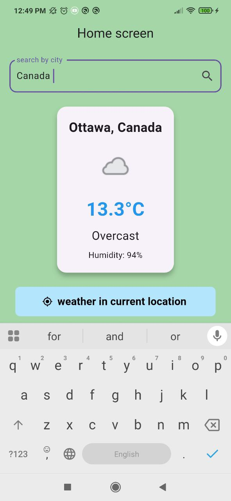
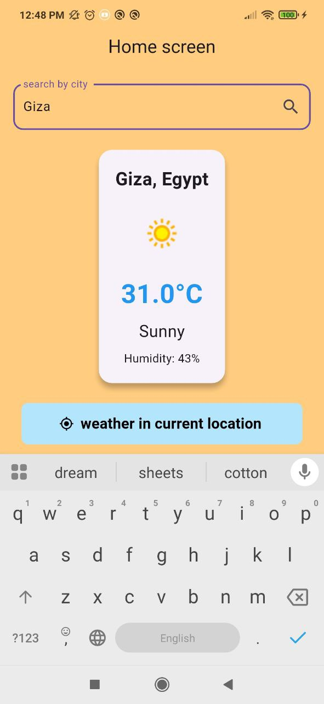
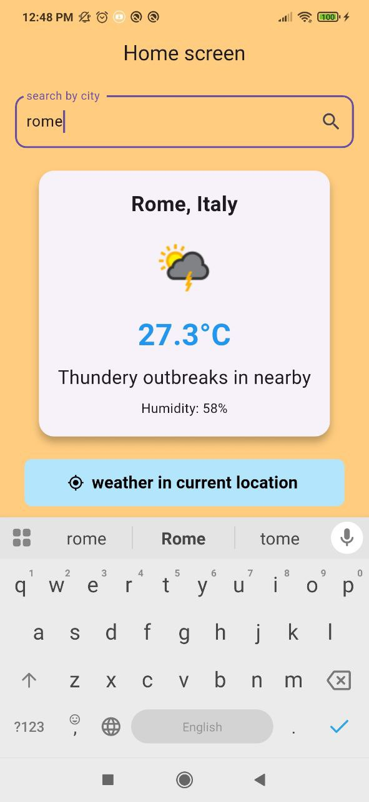
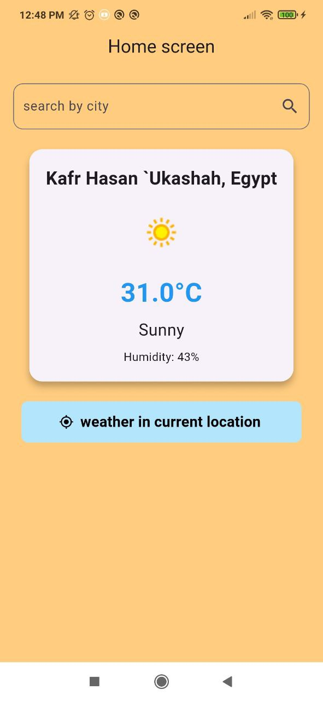

# 🌦️ Flutter Weather App  

A simple and modern **Flutter Weather Application** that allows users to:  
- Search for weather by **city name**  
- Get **current weather** using **device location**  
- Display weather details such as temperature, humidity, and condition  
- Change background color dynamically based on temperature  

---

## 🚀 Features  
- 🌍 Search weather by city name  
- 📍 Get weather in your current location  
- 🎨 Dynamic background color based on temperature  
- 🖼️ Local images for weather/location cards  
- 🔍 City name suggestions using WeatherAPI `search.json`  

---

## 📸 Screenshots  

| Canada | Giza | Rome | My Location |
|--------|------|------|-------------|
|  |  |  |  |

---

## 🎥 Demo Video  
▶️ [Watch on YouTube](https://youtube.com/shorts/2RjkbVlnv_Q)  

---

## 🛠️ Technologies Used  
- **Flutter** (Dart)  
- **Provider** (State Management)  
- **Dio** (HTTP Requests)  
- **Geolocator** (Get Device Location)  
- **WeatherAPI** (Weather Data)  

---

## ⚙️ Installation  

1. Clone the repository  
   ```bash
   git clone https://github.com/MohannedAshraf/weather_app.git
   cd weather_app
